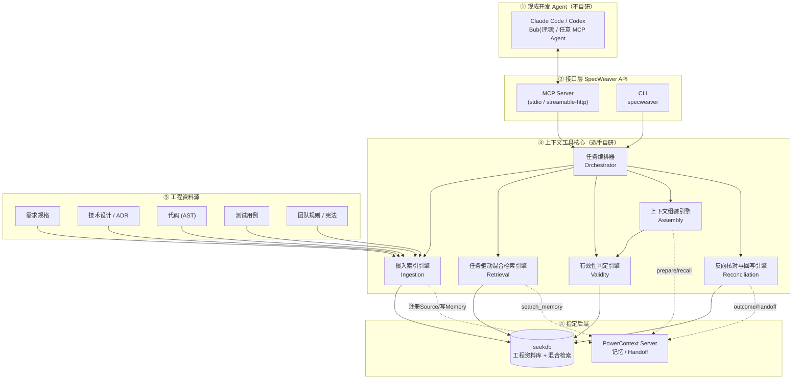
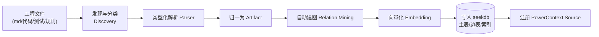
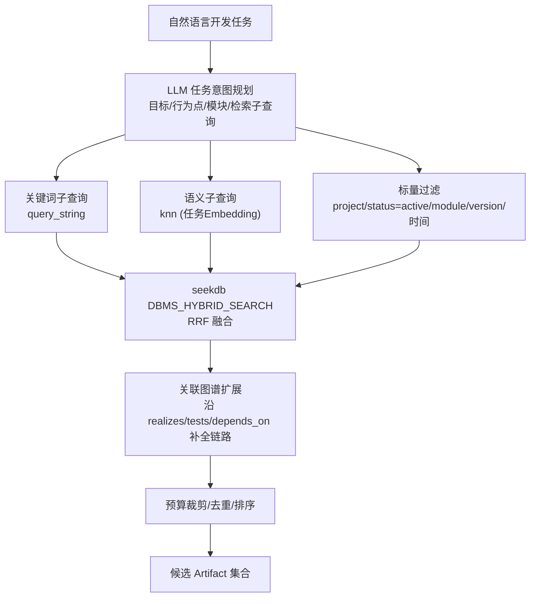
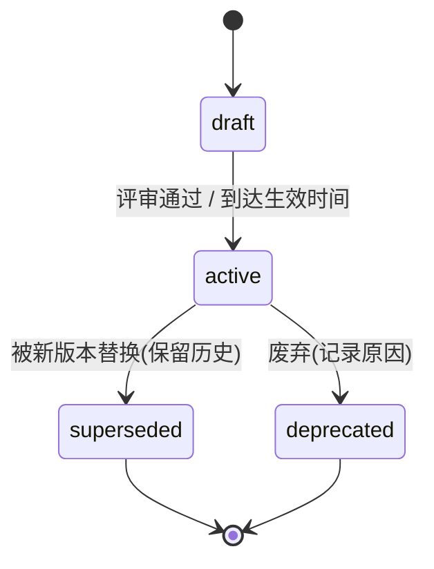
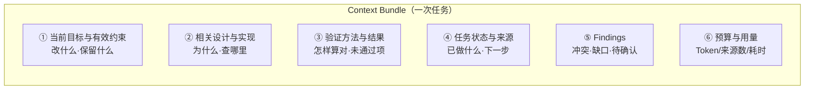
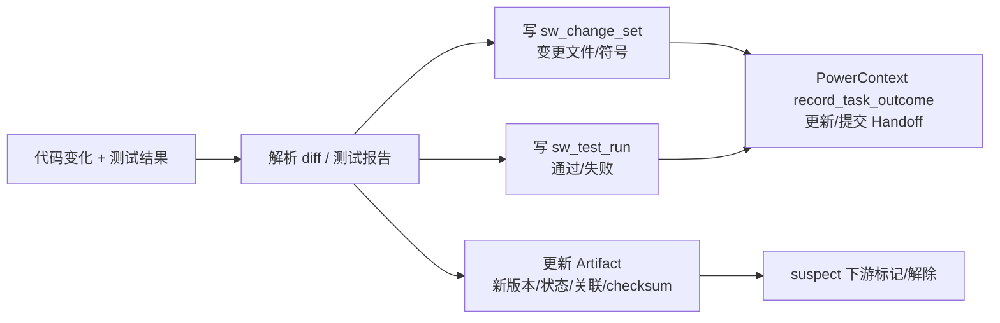
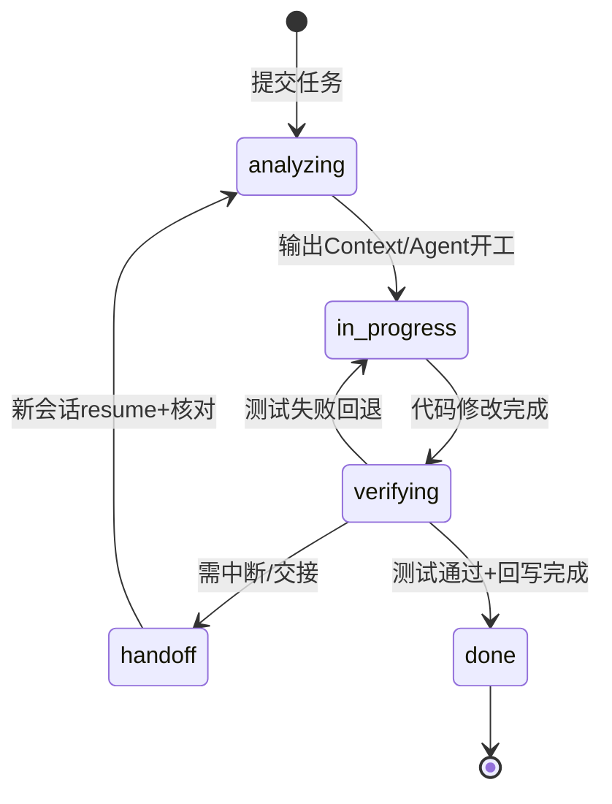
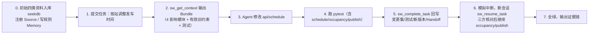

# SpecWeaver（规格织网）整体架构设计说明书

> 第六届 OceanBase 数据库大赛 · SDD 工程上下文工具赛题
> 版本：v1.0（架构定稿）　最后更新：2026-09-25

---

## 0. 阅读导引

本文档是 SpecWeaver 的**架构级定稿**，回答四个问题：

1. 我们要造的到底是什么（第 1 章）；
2. 它如何 1:1 覆盖赛题的职责、交付物与评分点（第 2 章）；
3. 系统由哪些层、模块、数据模型构成，数据如何流动（第 3–8 章）；
4. 如何演示、如何度量效果、如何落地与控风险（第 9–13 章）。

**核心结论先行**：

- SpecWeaver 是一个**运行时 SDD 工程上下文服务**，对上以 MCP/CLI 接入现成开发 Agent，对下内置两个官方指定后端——**seekdb（存储 + 混合检索）** 与 **PowerContext（记忆 + 任务交接）**。
- 我们**不把 GitHub Spec Kit 当作运行时骨架去"换数据库"**（那在概念上是错的，详见 1.3），而是把 Spec Kit 的**规格模板、项目宪法、检查清单**沉淀为 SpecWeaver 的"规格 Schema 与产出规范"。
- 选手自研的核心价值集中在五个引擎：**摄入索引、任务驱动混合检索、有效性与冲突/缺口判定、上下文组装、反向核对与回写**。

---

## 1. 产品定位与设计目标

### 1.1 一句话定位

> SpecWeaver 是规格驱动开发（SDD）的"工程上下文运行层"：在 Agent 每次动手前，给出**当前有效、最小充分、来源可核对**的工程依据；在任务完成后，把代码变化与验证结果**反向织回**工程记录，让下一轮（或下一位接手者）从最新状态无缝接续。

### 1.2 设计目标（可验证）

| 编号 | 目标 | 度量方式 |
|---|---|---|
| G1 | **约束不遗漏**：一次任务所需的需求/设计/代码/测试/团队规则被完整召回并关联 | 关键约束覆盖率（人工 + 规则核对）、任务成功率 |
| G2 | **新旧可分辨**：只输出当前有效约束，识别并隔离被替换/废弃的旧要求 | 过时约束误召回率、版本状态准确率 |
| G3 | **冲突缺口可见**：自动检测矛盾要求、链路缺失、下游未同步 | 检测召回率/准确率，演示必现 |
| G4 | **上下文最小充分**：在字节/Token 预算内交付，避免信息过载 | 单次上下文 Token、p95 组装耗时 |
| G5 | **记录可接续**：任务中断/换人/换 Agent 后可恢复，且先核对实际工程状态 | 接续成功率、记录与实际一致率 |
| G6 | **闭环可复现**：提供依据→改代码→跑测试→回写记录全链路可复现、可追溯 | 一键演示 + 证据链 |
| G7 | **指定组件真实参与**：seekdb、PowerContext 实际承担运行时职责并在演示中呈现 | 组件操作日志、数据流证据 |

### 1.3 关键架构判断：为什么不是"改造 Spec Kit 换数据库"

调研结论（详见《调研纪要》）：

- **GitHub Spec Kit 的本质**是"开发期规格产出工具"——一个 Python 脚手架 CLI（`specify`）+ 一套 Markdown 模板与 Slash 命令（`specify/plan/tasks/implement/converge`）+ 约定的文件目录。它**没有运行时数据库、没有检索引擎、没有持久记忆服务**，其核心价值恰恰是**人机可读的 Markdown 规格文件流转**。
- **赛题要求的工具**是"运行时上下文服务"——在 Agent 执行任务时实时检索、关联、判定有效性、维护记忆并反向回写。

因此"把 Spec Kit 的文件存储替换成 OceanBase"是一个**概念错位**：会破坏 Spec Kit 的价值，又无法自然长出运行时检索与记忆能力。

**我们的取舍**：

- Spec Kit 以"**方法论与模板资产**"的身份参与：其 `constitution / spec / plan / tasks / checklist` 模板被吸收为 SpecWeaver 的规格 Schema、入库解析规则与产出规范（第 4.3、7.3 节）；
- 运行时骨架由 SpecWeaver 自研，存储与记忆**原生**落在 seekdb 与 PowerContext 上；
- 这样既"站在高质量开源项目的肩膀上"，又精确满足赛题运行时要求，且在"方案取舍"上有清晰可辩护的叙事。

---

## 2. 赛题对齐矩阵

### 2.1 与"组件职责分工"对齐（赛题 10.1）

| 赛题指定组件 | 在 SpecWeaver 中的落地 | 演示必现效果 |
|---|---|---|
| **seekdb** | 唯一权威工程资料库：四类要素结构化存储 + 全文索引 + 向量索引 + 关系关联，承担混合检索 | 真实工程数据入库；检索条件（关键词/语义/版本/状态/模块）设置；结果来源追溯 |
| **PowerContext** | 工作记忆与交接层：决策/约束 Memory、进度与 Handoff、跨会话接续 | 开发决定、约束规则、开发进度的读取/更新；中断后新会话恢复 |
| **选手上下文工具（SpecWeaver）** | 五引擎 + 接口层：信息关联、有效性判断、按任务组织、持续维护 | Agent 实际收到的上下文内容，以及上下文带来的开发效果（测试通过、旧行为不破坏） |

### 2.2 与"四大痛点 / 上下文输出标准"对齐（赛题 4.1 / 4.2）

| 赛题痛点 | SpecWeaver 机制 |
|---|---|
| 资料分散 | 统一摄入管道把规格/设计/代码/测试/规则归一为 Artifact 模型并入库 |
| 新旧并存 | 有效性状态机 + 版本/生效时间窗 + supersedes 闭包 + 实际工程核对 |
| 信息关联 | 关联图谱（需求→设计→代码→测试双向边）+ 检索结果图扩展 |
| 状态变化 | 反向回写（变更集/测试运行/任务事件）+ 接续前核对 |

输出的 Context Bundle 严格按赛题 4.2 四段式组织（第 7 章）：当前目标与有效约束 / 相关设计与实现 / 验证方法与结果 / 任务状态与来源，并额外给出**冲突·缺口·待确认清单**。

### 2.3 与"四大交付物"对齐（赛题 8.1）

| 交付物 | 本方案产出 |
|---|---|
| 工具源码与接入说明 | `specweaver/` 源码包 + `docker-compose` 一键起依赖 + Agent MCP 接入文档 + `specweaver doctor` |
| 完整任务演示 | 铁路调度案例全流程脚本（提供依据→改代码→执行验证→更新记录→中断接续） |
| 可核对结果 | `evidence/`：Context Bundle（含 citation）、代码 diff、pytest 报告、Handoff 记录、资源用量（Token/调用次数/耗时） |
| 清楚的方案说明 | 本架构说明书 + 调研纪要 + 设计取舍与适用范围章节 |

### 2.4 与"四大创新方向"对齐（赛题 9）

| 创新方向 | SpecWeaver 差异化设计 |
|---|---|
| 工程信息关联 | AST + 显式标签 + 语义匹配 + 提交信息的**多证据自动建图**，边带置信度与证据 |
| 任务驱动检索 | LLM 任务意图规划 → 子查询分解 → 全文/向量/标量三路召回 → RRF → 图谱扩展 → 预算裁剪 |
| 有效性与变更处理 | 状态机 + 时间窗 + supersedes 闭包 + 规则/语义双层冲突检测 + suspect 下游过时标记 |
| 记忆与增量维护 | 与 PowerContext 深度对接；增量变更集写入、版本化 Handoff、接续三方核对（代码/库/记忆） |

---

## 3. 总体架构

### 3.1 分层架构总览



### 3.2 组件职责边界

| 层 | 组件 | 职责 | 是否自研 |
|---|---|---|---|
| ① Agent | 现成 Coding Agent | 实际改代码、跑测试、做决策 | 否（接入） |
| ② 接口 | MCP Server / CLI | 暴露工具能力、鉴权、参数校验、结果序列化 | 自研（薄） |
| ③ 核心 | 五引擎 + 编排器 | 关联、检索、有效性、组装、回写（**主要工作量与得分点**） | 自研 |
| ④ 后端 | seekdb | 存储 + 全文/向量/标量混合检索 | 指定组件（部署 + 适配） |
| ④ 后端 | PowerContext | 工作记忆、上下文接续、Handoff | 指定组件（部署 + 适配） |
| ⑤ 源 | 工程资料 | 需求/设计/代码/测试/规则 | 既有 |

### 3.3 权威来源（Single Source of Truth）原则

为避免 seekdb 与 PowerContext 双写不一致，明确权威次序：

1. **实际工程状态（Git 仓库 + 真实测试结果）是最终事实来源**；
2. **seekdb 是工程要素的权威结构化存储**（版本、关联、索引）；
3. **PowerContext 是工作记忆与交接视图**，其条目以**引用 + 版本号**指向 seekdb/工程，不独立持有"事实"；
4. 任何"完成"状态必须能回溯到真实代码变更与测试结果（赛题 6.4 核心准则）。

冲突时按 1 > 2 > 3 修正，并在事件日志留痕。

---

## 4. 数据模型设计（seekdb）

### 4.1 统一 Artifact 元模型

所有工程要素在工具内部归一为 **Artifact**：

| 字段 | 说明 |
|---|---|
| `artifact_id` | 全局稳定 ID，如 `REQ-0001` / `DSN-0003` / `CODE-schedule.recompute` / `TST-0012` / `RULE-007` |
| `project` / `module` | 所属项目、模块（如 schedule / occupancy / publish / api） |
| `type` | `requirement` / `design` / `code` / `test` / `rule` |
| `title` / `content` | 标题与正文（代码为带注释源码片段/签名摘要） |
| `version` | 语义版本，如 `1.2.0` |
| `status` | `draft` / `active` / `superseded` / `deprecated` |
| `effective_from` / `effective_to` | 生效时间窗（nullable 表示长期有效） |
| `applies_to_ref` | 适用版本/分支/产品范围 |
| `supersedes` / `superseded_by` | 版本替换链 |
| `based_on_refs` | 本要素所依据的上游要素版本（用于 suspect 检测） |
| `source_uri` / `source_locator` | 原始文件 URI + 行范围（可核对来源） |
| `checksum` | 内容哈希（用于实际工程核对） |
| `tags` | 标签（行为点、关键词） |
| `embedding` | 文本向量（VECTOR） |
| `created_at` / `updated_at` / `source_kind` | 审计字段 |

### 4.2 seekdb 物理表（SQL / 堆表）

> seekdb 兼容 MySQL 语法并扩展 VECTOR / FULLTEXT / HNSW；检索统一走 `DBMS_HYBRID_SEARCH.SEARCH`。

> **实现落点（v1.4.0 容器实测，详见《02》7.1）**：以下 DDL 为设计蓝图。实际交付中 artifacts 落 pyseekdb **Collection `sw_artifacts_v2`**（记录键为 `{project}:{id}`——REQ-1 这类逻辑 id 跨项目会撞，必须项目隔离；HNSW dim=1536/l2，全文+向量+标量经 `hybrid_search` RRF 融合，等价覆盖 `sw_artifact` 职责）；关系边落原生表 `sw_relations_v2`（`uq_edge` 含 project_id 四列唯一）；活动证据落 `sw_change_set` / `sw_test_run`。`sw_project` / `sw_task` / `sw_event` 未建：project 维度由 metadata 承载，Task 为调用方传入的轻量标识，事件留痕由两张活动表承担。`DBMS_HYBRID_SEARCH` 包在 v1.4.0 不存在（《02》1.4 勘误）。

```sql
-- 项目表
CREATE TABLE sw_project (
  project_id    VARCHAR(64) PRIMARY KEY,
  name          VARCHAR(255),
  root_uri      VARCHAR(1024),
  current_ref   VARCHAR(255),       -- 当前分支/版本基线
  created_at    DATETIME
) ORGANIZATION HEAP;

-- 工程要素主表（五类统一）
CREATE TABLE sw_artifact (
  artifact_id     VARCHAR(96) PRIMARY KEY,
  project_id      VARCHAR(64),
  type            VARCHAR(16),     -- requirement/design/code/test/rule
  module          VARCHAR(64),
  title           VARCHAR(512),
  content         TEXT,
  version         VARCHAR(32),
  status          VARCHAR(16),     -- draft/active/superseded/deprecated
  effective_from  DATETIME,
  effective_to    DATETIME,
  applies_to_ref  VARCHAR(255),
  supersedes      VARCHAR(96),
  superseded_by   VARCHAR(96),
  source_uri      VARCHAR(1024),
  source_locator  VARCHAR(128),    -- e.g. L42-L88
  checksum        VARCHAR(128),
  tags            VARCHAR(512),
  embedding       VECTOR(1024),    -- 维度以所用 Embedding 模型为准
  created_at      DATETIME,
  updated_at      DATETIME,
  FULLTEXT INDEX ft_artifact_title(title),
  FULLTEXT INDEX ft_artifact_content(content),
  VECTOR INDEX idx_artifact_emb(embedding)
      WITH (distance=l2, type=hnsw, lib=vsag)
) ORGANIZATION HEAP;

-- 关联图谱（边表）
CREATE TABLE sw_relation (
  id          BIGINT PRIMARY KEY,
  project_id  VARCHAR(64),
  src_id      VARCHAR(96),
  src_type    VARCHAR(16),
  dst_id      VARCHAR(96),
  dst_type    VARCHAR(16),
  relation    VARCHAR(32),  -- realizes/refines/covers/constrains/calls/tests/depends_on/supersedes
  confidence  DOUBLE,       -- 0~1
  evidence    VARCHAR(1024),-- 建边依据（标签/AST规则/相似度/提交）
  created_at  DATETIME
) ORGANIZATION HEAP;

-- 开发任务
CREATE TABLE sw_task (
  task_id     VARCHAR(64) PRIMARY KEY,
  project_id  VARCHAR(64),
  title       VARCHAR(512),
  objective   TEXT,
  status      VARCHAR(16),  -- analyzing/in_progress/verifying/handoff/done/blocked
  branch      VARCHAR(255),
  base_ref    VARCHAR(255),
  handoff_rev VARCHAR(128),
  created_at  DATETIME,
  closed_at   DATETIME
) ORGANIZATION HEAP;

-- 任务事件/操作日志（增量维护、可审计）
CREATE TABLE sw_event (
  event_id    BIGINT PRIMARY KEY,
  task_id     VARCHAR(64),
  phase       VARCHAR(32),
  action      VARCHAR(64),
  payload     JSON,
  citations   JSON,
  ts          DATETIME
) ORGANIZATION HEAP;

-- 变更集（代码 diff 结构化）
CREATE TABLE sw_change_set (
  change_id       VARCHAR(64) PRIMARY KEY,
  task_id         VARCHAR(64),
  diff_uri        VARCHAR(1024),
  files_changed   JSON,   -- [{path, change_type, symbols}]
  test_run_id     VARCHAR(64),
  base_checksum   VARCHAR(128),
  head_checksum   VARCHAR(128),
  ts              DATETIME
) ORGANIZATION HEAP;

-- 测试运行结果
CREATE TABLE sw_test_run (
  test_run_id VARCHAR(64) PRIMARY KEY,
  task_id     VARCHAR(64),
  command     VARCHAR(1024),
  total       INT, passed INT, failed INT, skipped INT,
  report_uri  VARCHAR(1024),
  commit_ref  VARCHAR(255),
  ts          DATETIME
) ORGANIZATION HEAP;
```

**设计要点**：

- 五类要素统一主表 + `type` 区分，便于一次混合检索跨类型召回；`module/status/version/project_id` 作为标量过滤维度；
- 关联独立边表，支持双向追溯与图扩展，边带 `confidence/evidence` 以支撑"自动建图可信度"叙事；
- `change_set / test_run / event` 三表承载"反向更新 + 增量维护 + 可审计"。

### 4.3 规格模板资产（吸收自 Spec Kit）

SpecWeaver 内置并改造以下模板（随包分发于 `specweaver/templates/`）：

- `constitution.md`：项目宪法/不可动摇原则（对应"团队规则 + 必须保留行为"）；
- `spec-template.md`：需求规格（行为、约束、验收条件）；
- `plan-template.md`：技术设计（方案、接口、决策与取舍 ADR）；
- `tasks-template.md`：任务拆解；
- `checklist-template.md`：交付检查清单。

这些模板同时作为：① 入库解析的字段抽取规则；② 新规格产出的规范；③ 有效性/缺口判定的结构依据。

---

## 5. 核心引擎设计（一）：摄入索引引擎 Ingestion

### 5.1 处理管道



### 5.2 类型化解析器

| Parser | 输入 | 抽取要素 |
|---|---|---|
| RequirementParser | 规格 md（Spec Kit 模板） | 行为点、约束、验收条件、版本、状态、生效范围 |
| DesignParser | 设计文档 / ADR | 架构决策、接口定义、技术取舍、上下游依赖 |
| CodeParser | 源码（**标准库 `ast`**，Python 优先、可扩多语言） | 文件、类、函数、签名、调用关系、引用、模块归属 |
| TestParser | 测试代码 | 用例名、断言、覆盖标记（`@covers`/命名）、测试入口 |
| RuleParser | 宪法/规范/约定 | 团队规则、发布/评审约束、代码规范 |

### 5.3 多证据自动建图（创新点）

为每对要素计算关联，证据来源按优先级融合，边带置信度：

1. **显式标签**：`@implements REQ-0001`、`@covers TST-0012`、front-matter 引用（高置信）；
2. **AST 结构**：调用关系、导入依赖、测试调用被测符号（高置信）；
3. **命名/路径约定**：`test_<module>.py`、模块名对齐（中置信）；
4. **语义相似度**：Embedding 相似度 + 行为点对齐（中置信，作补充）；
5. **提交信息**：Git commit 关联规格/任务编号（中置信）。

输出标准链路边：`requirement -realizes-> design -realizes-> code <-tests- test`，以及 `constrains / depends_on / supersedes` 等。

### 5.4 增量摄入

- 基于 `checksum` + Git diff 判定变更文件，仅重解析/重写变化部分（增量维护，呼应创新点四）；
- 上游新版本触发 suspect 标记（第 6 章）；
- 每次摄入以 checksum 差分报告（新增/更新/未变/跳过 + 建边数）返回，并在 PowerContext 记一条 ingestion 备忘（实现注记：不设独立 `sw_event` 表，活动留痕由 `sw_change_set` / `sw_test_run` 承载）。

---

## 6. 核心引擎设计（二）：检索 + 有效性

### 6.1 任务驱动混合检索（创新点）



**检索 DSL 示例**（全文 + 向量 + 标量过滤 + RRF）：

```json
{
  "query": {
    "bool": {
      "must": [
        { "query_string": { "fields": ["title^2", "content"], "query": "发车时间 调整 站点" } }
      ],
      "filter": [
        { "term":  { "project_id": "railway" } },
        { "term":  { "status": "active" } },
        { "terms": { "module": ["api", "schedule", "occupancy", "publish"] } }
      ]
    }
  },
  "knn": {
    "field": "embedding",
    "k": 20,
    "query_vector": "<任务文本 Embedding>",
    "filter": [
      { "term": { "project_id": "railway" } },
      { "term": { "status": "active" } }
    ]
  },
  "rank": { "rrf": { "rank_window_size": 40, "rank_constant": 60 } }
}
```

> 也提供 Collection API（`collection.hybrid_search(query/knn/rank)`）作为快速通道；SQL 通道用于需要跨表关联与强一致的场景。

> **实现约定（M3.2）**：检索阶段默认 `only_active=False`，不按 status 硬过滤，而把状态/时间/范围判定统一交给有效性引擎；候选集因此同时包含被替换版本，便于直接产出冲突与过时 findings。标量过滤主要用于 project/module/version 收窄范围。

> **实现约定（M4 批 6，真实 LLM provider 接入后）**：LLM 规划的收窄有三道确定性防线——① `modules` 以 catalog 真实 active 模块清单为白名单（幻觉模块名被丢弃），且收窄命中为空时自动放宽重试一次；② **约束保底**：active 的 requirement/rule 一律并入候选（score 0.0 不参与抢排名），保证"有效旧约束"绝不因 types/modules 收窄而丢失（冲突镜头的确定性来源）；③ 完整性检查（gap）在有效性引擎侧按全项目需求扫描，不依赖检索命中。LLM 失败不静默：降级原因透出到 `RetrievalPlan.rationale`。

### 6.2 有效性判定引擎（创新点，G2/G3）

#### 6.2.1 生命周期状态机



#### 6.2.2 四维有效性判断

一条 Artifact 被判定为"当前有效"，需同时满足：

1. **状态维**：`status=active`，沿 `superseded_by` 链确认无更新版本；
2. **时间维**：当前时间落在 `effective_from ~ effective_to`；
3. **版本/范围维**：当前分支/产品版本命中 `applies_to_ref`；
4. **工程核对维**：对应代码符号/文件真实存在且 `checksum` 与记录一致（接续时强制）。

#### 6.2.3 冲突 / 缺口 / 过时检测（Findings）

| 检测 | 规则 | 输出 |
|---|---|---|
| **冲突 Conflict** | 同一模块/行为点存在多条 active 约束，结构化规则矛盾（阈值/枚举/前置条件不一致）或 LLM 语义判定矛盾 | 冲突点、双方来源、严重级、建议、**需人工确认** |
| **缺口 Gap** | 沿 `requirement→design→code→test` 链路检查覆盖；代码无测试、需求无设计等 | 缺失环节、建议补全项 |
| **过时 Suspect** | 上游产生新版本，下游 `based_on_refs` 指向旧版；代码已变但无关联变更集 | 待同步下游清单、风险 |
| **来源存疑** | 群聊猜测/单次环境结论被当作通用规则（证据等级不足） | 降级为"待核实"，不进约束 |

所有 Findings 进入 Context Bundle 显著位置，"待核实"与"已验证"同等显眼（呼应 PowerContext 设计哲学）。

> **实现约定（M3.2）**：冲突检测只对"同模块、同约束主体"且**数值不同或极性相反**的可证明情形报错——主体通过屏蔽数值与情态/极性词后归一，刻意不做臆测性语义冲突，LLM 语义判定留作可选增强。"来源存疑"由 artifact 的显式 tentative/unverified 标记（tags/front-matter）驱动，命中即降级为"待核实"、不进入约束。

---

## 7. 核心引擎设计（三）：上下文组装引擎 Assembly

### 7.1 Context Bundle 结构（严格对齐赛题 4.2）



| 分段 | 内容 | 每条形如 |
|---|---|---|
| ① 目标与约束 | 任务目标、必须保留行为、active 约束、团队规则 | 内容 + `[REQ-0001 v1.2 · file#L · 时间]` |
| ② 设计与实现 | 设计决策、接口定义、代码文件/符号位置、修改范围、历史技术背景（债务） | 位置 + 设计依据 citation |
| ③ 验证 | 验收条件、测试入口/命令、相关测试用例、历史测试结果 | 用例 ID + 覆盖点 + 最近结果 |
| ④ 状态与来源 | 已完成工作、待办、阻塞、来源清单与更新时间 | 进度 + 事件引用 |
| ⑤ Findings | 冲突/缺口/过时/待确认 | 严重级 + 建议 + 是否需确认 |
| ⑥ 用量 | 字节/Token 预算、来源数量、组装耗时 | 数值 |

> 实现注记（M4 批 1）：③ 的"历史测试结果"由 `ContextBundle.last_test_run` 承载——`GetContext` 经 `ActivityLogPort.list_test_runs`（约定新→旧）取该工程最近一次 TestRun，渲染为一行证据（PASS/FAIL、通过数、commit ref、命令），其字节计入预留后再裁剪要素。

### 7.2 组装策略：最小充分 + 渐进披露

- 目标是"完成下一步所需的**最小充分**上下文"，而非全量堆砌；
- 采用 **just-in-time + progressive disclosure**：保留轻量引用，运行时按需展开；
- 预算控制：默认上限对齐 PowerContext PreparedContext（约 8,000 UTF-8 bytes，可配置）；**实现口径（M6 批 b）**：先扣固定 chrome，再给 findings 至多 35%、为 goal 段（规则+需求）保底 40%，剩余字节按"段优先级（规则/需求 → 设计/代码 → 测试）+ 段内相关度降序"填充，检索层的相关度分数因此真正参与裁剪（此前分数在装配边界被丢弃）；
- **每条信息必带 citation**（artifact_id + version + source_uri#locator + updated_at），支持一键回源。

### 7.3 输出形态

- 给 Agent：Markdown（人/Agent 可读）+ 结构化 JSON（便于程序处理与归档）双份；
- 同时落盘 `evidence/context-<task>-<step>.json` 作为可核对证据。

---

## 8. 核心引擎设计（四）：记忆对接 + 反向回写

### 8.1 PowerContext 适配（记忆与交接）

| 赛题/PowerContext 概念 | SpecWeaver 调用（PowerContextClient） |
|---|---|
| Scope（项目范围） | 按确定性 title `sw:{project}` 幂等解析（`ensure_scope`，实测 scope_id 由服务端生成、不可指定），Scope = project；运行期由 `MemoryPort.resolve_scope` 承载，driving 层在需要记忆/交接且 scope 为空时经 `app.ensure_scope` 惰性解析 |
| Source（证据来源） | 摄入注册 ingestion 备忘；任务结果写入新 source（实测：单 principal 下 outcome 需挂到新 source） |
| Memory（长期记忆） | 关键约束/决策 `remember`（带 citation/tags）；`search` 召回。官方契约（powercontext RFC 0014 记忆层设计）：**同一 scope 内相同文本是 no-op**——响应 `entry: null` 且 revision 不推进，且请求体不允许额外幂等键字段；适配器据此在 `entry=null` 时用 `entries/list` 回读既有条目，使"同一任务重复跑"保持幂等而非报错 |
| PreparedContext | 运行时 `prepare_context` 作为工程库召回的补充（可选增强，当前主链路未接） |
| Handoff（交接） | `prepare-current → commit`（next_action 为单字段，首个下一步进 next_action、其余入 state） |
| 接续 | `continue`（selection=exact + revision）。实测注记：`acknowledge` 属互不信任多 Agent 安全协议，单 principal 422/409 不可用，已从 HandoffPort 删除 |
| 任务结果 | `record_task_outcome`（observations/checks 以 declared basis 记录） |
| 经验复用 | `propose_experience/skill` → `approve_artifact_candidate`（Review 后沉淀，⏳ 未排期） |
| 记忆维护 | `revise_memory_entry` / `retire_memory_entry`（停用不抹历史；✅ M5 由 `RecordDecision` 用例消费，`sw_record_decision` 暴露）。实测注记：revise 必须先用 `entries/list` 取最新 citation（陈旧 revision → 409 revision_conflict），且 revise 到重复文本不会触发上述 remember 去重 |

**分工原则**：seekdb 回答"工程依据是什么"，PowerContext 回答"这摊工作进行到哪、下一棒怎么接"。SpecWeaver 负责二者一致性（第 3.3 权威次序）。

### 8.2 反向核对与回写引擎 Reconciliation

#### 8.2.1 反向更新链路



#### 8.2.2 接续前三方核对（赛题 5.2）

新会话/接手者 `resume` 时：

1. 从 PowerContext `continue_handoff` 恢复目标、进度、待办；
2. **核对实际工程**：Git 当前 ref / 文件 checksum / 符号存在性 / 测试真实结果；
3. 与 seekdb 记录、PowerContext 记忆三方比对，产出 StateMismatch 清单；以实际工程为准，但**不臆改 catalog**——在最新上下文中排除过时记录，并提示重新 ingest 对应文件作为修复动作；
4. 重新跑有效性判定（第 6.2），生成最新 Context Bundle；
5. 准则：记录帮助接续，但正确性依赖实际核对（赛题 5.2）。

### 8.3 任务编排器 Orchestrator

串联一次任务生命周期，保证每步闭环与留痕：



---

## 9. 对外接口设计

### 9.1 MCP Server（主接口，接入现成 Agent）

装配根 `di.run()` 构造 `SpecWeaverApp` 后调用 `build_mcp(app)` 注册工具；每个工具是用例的薄包装（参数/返回用 Pydantic，`SWError` 统一映射为 MCP `ToolError`）。工具名以实现为准：

| MCP Tool | 作用 | 关键入参 | 状态 |
|---|---|---|---|
| `sw_ping` | 存活探针 | — | ✅ 已交付 |
| `sw_doctor` | 后端连通 + 推理模式（复用 `app.doctor()`） | — | ✅ 已交付 |
| `sw_ingest_project` | 摄入/增量索引工程资料，注册 ingestion 备忘 | project_id, scope_id?, register_source | ✅ 已交付 |
| `sw_get_context` | **核心**：获取任务 Context Bundle（markdown + 引用 + 预算） | project_id, task_text, base_ref? | ✅ 已交付 |
| `sw_complete_task` | 跑测试 + 反向回写 + 记录变更集/结果 | project_id, task_id, base_ref, scope_id? | ✅ 已交付 |
| `sw_resume_task` | 接续任务（三方核对 + 最新上下文） | project_id, scope_id?, handoff_rev? | ✅ 已交付 |
| `sw_handoff` | 生成/提交 Handoff（`CreateHandoff` 用例），返回 `handoff_rev` 供 `sw_resume_task` 接续 | project_id, objective?, state?[], next_steps?[], omissions?[], scope_id? | ✅ 已交付 |
| `sw_record_decision` | 决策沉淀：新记 / 改判（revises）/ 停用（retire），消费 `MemoryPort.revise/retire/list_entries` | project_id, decision?, rationale?, replaces_entry_id?, retire_entry_id?, scope_id? | ✅ 已交付 |
| `sw_report_progress` | 进度上报：写 progress 备忘，可选顺带提交 Handoff（组合 `CreateHandoff`） | project_id, note, update_handoff?, next_steps?[], omissions?[], scope_id? | ✅ 已交付 |
| `sw_verify` | 独立一致性核对报告（workspace↔catalog↔activity↔memory，含 junit 对账） | project_id, scope_id? | ✅ 已交付 |
| `sw_explain_source` | 来源追溯：回源指针 + upstream `based_on` 链 + downstream 关系邻域 | project_id, artifact_id, depth(1-3) | ✅ 已交付 |

- `scope_id` 可选：为空且操作需记忆/交接时，由 `app.ensure_scope` → `MemoryPort.resolve_scope` 按确定性 title `sw:{project}` 幂等解析；
- `sw_handoff` 契约（用例先行校验 + 适配器翻译，均可追溯 `SWError`；MCP 映射 `ToolError`、CLI 打印错误行并退出码 2）：`objective` 非空、`state` 至少一条"已完成"声明；`next_action` 为单字段，仅承载首个 next step，其余步骤放 `state`；空 source_id 时适配器生成唯一里程碑 source（PC 契约：同一 source 不同内容 → 409）。
- 传输：本地 stdio（`run_stdio`，Agent 拉起）或 streamable-http（`run_http`，共享服务），二者均经 `di.run()` 生命周期持有后端连接；streamable-http 在同端口 `/mcp` 之外另暴露 `GET /metrics`（Prometheus 0.0.4 文本，见第 11 节），`/metrics` 以插入既有 Starlette 路由的方式挂载，保留 FastMCP 会话管理器的 lifespan；
- Agent 侧仅需在 MCP 配置中加入 SpecWeaver，即可在提示词中调用上述工具。

### 9.2 CLI（运维与演示）

M4 批 2/3 已交付（与 MCP 工具共用同一 application 用例与 `ensure_scope` 规则，均经 `di.run()` 装配根）：

```
specweaver doctor
specweaver ingest  <project_id> [--scope-id ...] [--register-source/--no-register-source]
specweaver context <project_id> "<任务描述>" [--base-ref ...]
specweaver finish  <project_id> <task_id> <base_ref> [--test-command ...] [--scope-id ...]
specweaver handoff <project_id> [--objective ...] [--state ...]x [--next-step ...]x [--omission ...]x
specweaver resume  <project_id> [--objective ...] [--handoff-rev ...] [--use-handoff/--no-use-handoff]
specweaver version
```

- 公共输出选项：`--json`（机器可读，可直接被 Agent/脚本解析）、`--usage-out <path>`（导出本进程 Telemetry 跨度 CSV：耗时 / llm_calls / tokens / backend_calls / 引擎级指标 `metrics`（JSON 列），计数为真实链路）；
- `finish` 在被测测试失败时以退出码 1 结束（变更集仅在成功时写入）；`handoff` 输出的 rev 供 `resume --handoff-rev` 接续；
- `init` / `task` / `--watch` 等运维糖衣按评测需要再补；M5 的四个新用例（决策沉淀/进度上报/一致性核对/来源追溯）当前只经 MCP 暴露，CLI 未追加同名命令（同一 `di.run()` 用例入口，需要时按现有薄包装模式加命令即可）。

### 9.3 Agent 接入策略

- **演示首选**：Bub（PowerContext 中标记 `evaluation`，轻量、可脚本化，疑似官方评测口径），并同时验证 Claude Code / Codex；
- 正式评测 Agent 以官方题包为准（赛题 10.2），SpecWeaver 基于标准 MCP，对 Agent 品牌无绑定。

---

## 10. 演示方案：铁路调度软件（赛题第七章）

### 10.1 演示项目 `demo/railway`

一个可运行的 Python + pytest 教学项目（声明：不代表真实铁路规则）：

| 模块 | 职责（对应赛题 7.3） |
|---|---|
| `api` | 页面/接口：选择目标站点、提交新车发时间（功能入口） |
| `schedule` | 时刻计算：更新当前站发车时间、重算后续各站时间 |
| `occupancy` | 车辆占用检查：对照车辆其他任务检查时间窗冲突 |
| `publish` | 发布判断：检测到冲突则阻止发布 |

初始资产齐备：需求规格 v1、设计说明、代码、测试用例、团队规则（宪法）。

### 10.2 演示脚本（全链路）



### 10.3 必现的"工具价值"镜头

- 工具主动提示：**不能只验证新增按钮**，时刻计算、占用检查、发布判断三模块均需测试（赛题 7.4）；
- 制造并展示一次**冲突**（如旧规则"最小站间隔"与新需求矛盾）与一次**缺口**（新接口缺少测试），工具标注并引导确认；
- 制造一次**过时**：规格升版后下游测试被 suspect 标记。

### 10.4 证据链 `evidence/`

- `context-*.json/md`：含完整 citation 的上下文；
- `changes.diff`：代码差异（标注与规格对应关系）；
- `pytest-report.*`：通过率、覆盖需求点；
- `handoff-*.json`、`powercontext-events.*`：记忆与交接操作；
- `usage.csv`：Token、调用次数、耗时、资源用量。

---

## 11. 效果度量（评分"效率提升"）

参考 PowerContext 在 SWE-bench Pro / LoCoMo 的 OFF↔ON 对照方法：

| 指标 | 采集方式 |
|---|---|
| 任务成功率（功能符合 + 旧行为不破坏 + 测试通过） | 同一组任务，工具 OFF / ON 各跑 N 次 |
| 任务完成耗时 | 端到端计时 |
| Token / 模型调用用量 | Agent/Server 侧埋点汇总 |
| 关键约束覆盖率、过时误召回率 | 规则 + 人工核对 |
| 上下文组装 p95 耗时、单次上下文 Token | 引擎埋点 |

输出**同条件对照报告**（成功率、时间、调用用量差值），把"效率提升"落到可核对数字，而非主观断言。

**工具自身可观测性（M5 落地）**：`Telemetry` 除逐跨度 CSV（CLI/脚本 `--usage-out`，新增 `metrics` JSON 列）外，还提供 Prometheus 0.0.4 文本导出 `to_prometheus()`，streamable-http 模式经 `GET /metrics` 暴露：`sw_spans_total`、`sw_span_duration_ms_sum`、`sw_errors_total`、`sw_llm_calls_total`、`sw_llm_prompt_tokens_total`、`sw_llm_completion_tokens_total`、`sw_backend_calls_total` 按用例（span 名）聚合，`sw_engine_metric_sum{span,metric}` 承载引擎级指标（`recall/valid/excluded/assembly_ms/findings/bundle_bytes`），使上表"上下文组装耗时""单次上下文 Token"两项可在运行中直接抓取（`sw_span_duration_ms` 直方图族支持 `histogram_quantile(0.95, …)`，与官方记忆层 benchmark 的 p95 口径一致；逐跨度原始分布仍由 CSV 承担）；真实抓取样本见 `evidence/m5-*/metrics-probe.txt` 与 `evidence/retrieval-railway-*/metrics.txt`。

> **实测已交付（M4 批 5，2026-09-26）**：`specweaver/scripts/run_off_on.py` 驱动 Claude Code（deepseek-flash）对 demo/railway 同任务双臂各 N=3——easy 档（提示含联动答案）两臂 3/3 打平；**hard 档（赛题口径，只给最小接口契约）成功率 3/3 vs 3/3，ON 臂平均耗时 -26%（62.0s vs 83.5s）、输出 tokens -28%（10.9k vs 15.2k）、试错型命令调用减半**；小仓库下自主通读即可补齐正确性，工具增益集中在效率与方差，随仓库规模应放大。完整方法、逐 run 明细与工具调用构成见 `evidence/off-on/`（含局限性声明，未做任何美化）。报告口径自 M6 起同时给出**中位数、均值与最快/最慢**：hard 档 ON 中位 46.1s vs OFF 中位 82.3s（-44%），但 ON-0（95.3s）劣于全部 OFF run，N=3 下不宣称"必然更快"。

> **实测已交付（M6 批 b，2026-09-27）——检索质量金标**：`specweaver/scripts/eval_retrieval.py` + `demo/railway/gold/retrieval-gold.json`（6 个任务、人工标注、口径对齐 ContextBench 的 minimal-context 原则），两臂**同字节公平**对照（关键词臂拿到与 SpecWeaver 相同的构件字节、同一 `entry_block` 成本模型、只保留有命中文档）。
> - 生产预算 8000B：SpecWeaver **recall 1.0 / precision 0.204 / F1 0.326**，关键词基线 recall 0.847 / precision 0.257 / F1 0.367；
> - 紧预算 1500B：SpecWeaver recall 0.319 / precision 0.444，关键词基线 recall 0.500 / precision 0.639——**压力环境下我们暂时落后**；
> - 由此发现并修复两个真实缺陷：① findings 段可把预算吃光，导致规则/需求整段被清空（1500B 时 SpecWeaver recall 曾为 **0.0**），现由 goal 保底 + findings 上限解决；② 相关度分数在装配边界被丢弃，裁剪实际按 id 顺序发生，现按"段优先级 + 段内相关度"裁剪。
> - 未修的已识别问题（诚实挂账）：小语料未触及预算时 precision 仅 0.2，"最小充分"退化接近全量；紧预算下失败的主因是**条目渲染过胖**（同字节下能装的 gold 条目少于基线），下一步是按 aider 的渐进披露做法给低相关条目提供"仅引用"紧凑渲染。数据见 `evidence/retrieval-railway-8000/`、`evidence/retrieval-railway-1500/`。

---

## 12. 工程目录结构

```
E:\2026ob_projects\SDD\
├─ 赛题.md
├─ docs\
│  ├─ 01-架构设计说明书.md        ← 本文档
│  └─ 02-调研纪要.md
├─ research\                      ← 调研用克隆（不随交付）
│  ├─ spec-kit\
│  └─ powercontext\
├─ README.md / LICENSE             ← 交付物入口与许可（Apache-2.0）
├─ specweaver\                    ← 工具源码（交付物①）
│  ├─ pyproject.toml              ← extras：seekdb / powercontext / mcp / cli / server / dev
│  ├─ README.md                   ← 用法、11 工具读写口径、测试与配置
│  ├─ deploy\
│  │  ├─ docker-compose.yml       ← seekdb + powercontext 一键起（另有 build/run 两份 override）
│  │  ├─ .env.example
│  │  ├─ mcp.stdio.json / mcp.http.json   ← Agent 接入样例（stdio / streamable-http）
│  │  └─ wsl\                     ← WSL2 安装 / 构建 / 起停 / 等待脚本
│  ├─ templates\                  ← 吸收/改造自 Spec Kit 的 SDD 规格模板（§4.3）
│  ├─ scripts\                    ← gate.py + 演示与验证脚本（见文末）
│  ├─ src\specweaver\
│  │  ├─ domain\        entities / enums / values / rules / ports(6)   ← 零第三方依赖
│  │  ├─ application\   usecases(9) + engines(ingestion / retrieval / validity / assembly / reconciliation)
│  │  ├─ adapters\      driving(mcp: server/run_stdio/run_http · cli) + driven(seekdb / powercontext / workspace / inference)
│  │  └─ shared\        di.py 唯一装配根 · config · errors · telemetry
│  └─ tests\            unit（含 boundary 审计回归组） · contract · integration（真后端） · fakes
├─ demo\
│  └─ railway\                    ← 演示项目（M4 批 4 落地）
│     ├─ pyproject.toml           ← pytest pythonpath=src
│     ├─ .gitignore
│     ├─ src\ (api/schedule/occupancy/publish)
│     ├─ tests\
│     ├─ specs\                   ← 需求 REQ-1..（含升版 v2）
│     ├─ design\                  ← 设计 DES-x
│     └─ rules\                   ← 规则 RULE-x（宪法）
├─ evidence\                      ← 可核对证据（交付物③）：railway-<ts>/ · off-on-<ts>/ · m5-<ts>/
└─ specweaver\scripts\            ← 门禁与演示脚本（PowerShell 复杂逻辑下沉 Python）
   ├─ gate.py                      ← 一键门禁：离线 ruff+pytest；--live 追加真后端链路
   ├─ run_demo.py                  ← §10.2 全链路演示 → evidence/
   ├─ run_off_on.py                ← 工具 OFF/ON 双臂效率对照
   ├─ verify_mcp.py                ← 11 工具真实后端逐调用
   └─ probe_metrics_http.py        ← streamable-http 起服 + GET /metrics 实测
```

---

## 13. 技术选型、风险与实施计划

### 13.1 技术栈一览

| 用途 | 选型 | 备注 |
|---|---|---|
| 工程资料库/混合检索 | **seekdb**（Docker server，2881 SQL / 2886 HTTP） | Windows 不支持 embedded，统一用 server 模式 |
| 客户端 | `pyseekdb` | AdminClient/Client，SQL + Collection API |
| 记忆/交接 | **PowerContext Server** | persistence 可配 seekdb/oceanbase/sqlite |
| 工具语言 | Python 3.11+、Typer/Rich、Pydantic | 与两后端同生态 |
| 代码解析 | 标准库 `ast`（Python 优先，可扩多语言） | 建图与影响分析 |
| Agent 接入 | MCP（stdio / streamable-http） | 品牌无绑定 |
| Embedding/生成 | provider 可替换（赛题 6.3 不限定模型品牌）：LLM 现用 DeepSeek（OpenAI 兼容，实测点亮 llm\_calls/token 链路）；向量可选 MiniMax embo-01 / 千问 text-embedding / 确定性占位 | 意图规划/冲突语义判定 + 语义向量 |

### 13.2 风险与对策

| 风险 | 影响 | 对策 |
|---|---|---|
| PowerContext **Windows 实验性支持** | 本机运行可能异常 | 三选一预案：① Docker 运行 PowerContext Server；② WSL2；③ 实测本机 experimental。演示环境用 `docker-compose` 统一，规避宿主差异 |
| seekdb embedded 不支持 Windows | 无法用本地文件模式 | 统一 Docker server 模式，pyseekdb 以 host/port 连接 |
| 双写不一致（seekdb/PowerContext） | 上下文失真 | 第 3.3 权威次序 + 接续三方核对 + 事件留痕 |
| 自动建图误判 | 错误关联 | 多证据融合 + confidence 阈值 + 低置信仅作候选并标注 |
| 官方题包 Agent/参数未定 | 接入偏差 | 基于标准 MCP 解耦，题包发布后仅改配置；同时预置 Bub/Claude/Codex 三适配 |
| LLM 冲突判定幻觉 | 误报/漏报 | 结构化规则优先，LLM 结论标注证据并要求人工确认高风险项 |

### 13.3 实施计划（里程碑）

| 阶段 | 周期(建议) | 交付 |
|---|---|---|
| M0 架构与调研定稿 | 已完成 | 本说明书 + 调研纪要 |
| M1 环境与骨架 | 1 天 | docker-compose（seekdb+powercontext）跑通；SpecWeaver 空骨架 + doctor |
| M2 摄入索引引擎 | 2 天 | 五类 Parser、AST、自动建图、增量、入库 |
| M3 检索 + 有效性 | 2 天 | 混合检索 DSL、状态机、冲突/缺口/suspect |
| M4 组装 + 记忆 | 1.5 天 | Context Bundle、预算、PowerContext 全链路对接 |
| M5 反向回写 + 接口 | 1.5 天 | diff/test 解析、回写、resume 核对、MCP/CLI |
| M6 演示与度量 | 2 天 | 铁路案例全链路、证据链、OFF/ON 对照、文档定稿 |

### 13.4 设计取舍与适用范围

- **取舍**：以"运行时服务 + 模板资产"取代"改造 Spec Kit 换库"，换取概念一致性与运行时能力，代价是需自研五引擎；
- **适用**：中长期、多人/多 Agent 持续演进、需求频繁变更、强调可追溯与回归验证的工程；
- **不适用/边界**：一次性脚本、无测试基线、资料完全无结构且无法补充来源的场景；纯离线无任何模型 API 时，自动建图/语义冲突降级为规则模式（Basic memory）。

---

## 附录 A：待官方题包确认项

1. 官方指定/评测的开发 Agent（Bub 可能性）及其版本；
2. seekdb / PowerContext 的指定版本与部署参数；
3. 业务工程与必做场景的正式数据；
4. 评分权重与资源/时间限额。

> 以上项不阻塞架构落地：SpecWeaver 通过标准 MCP、可配置后端版本与可插拔模型保持解耦，题包发布后以配置方式对齐。
